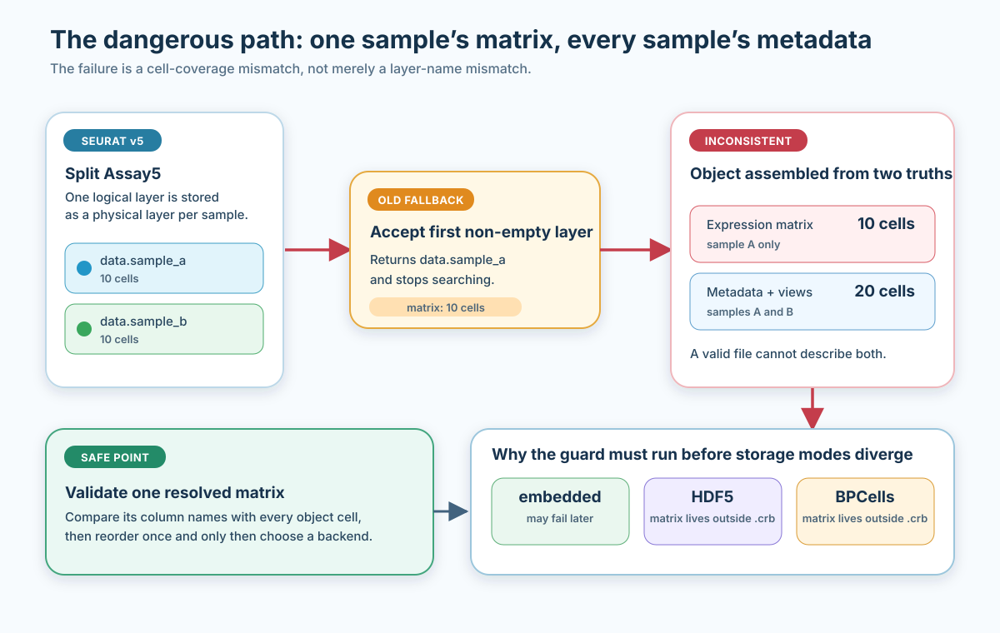
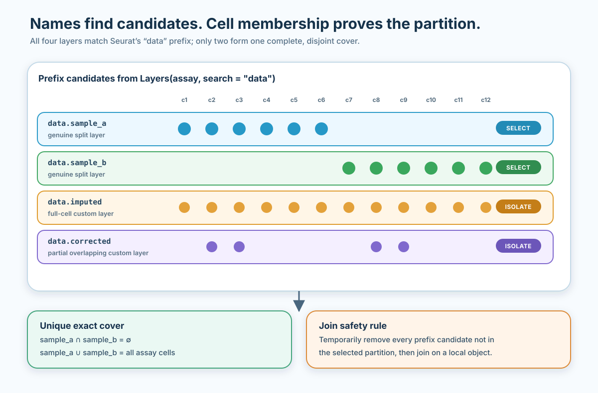
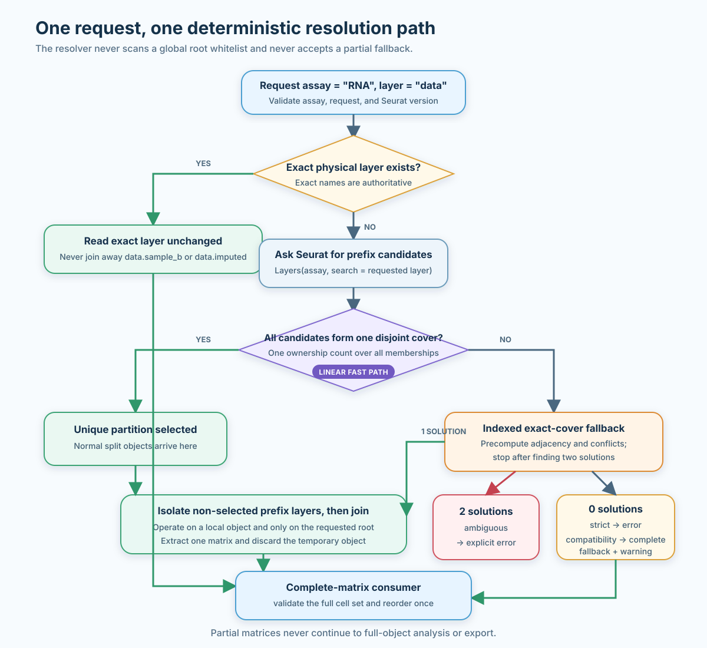
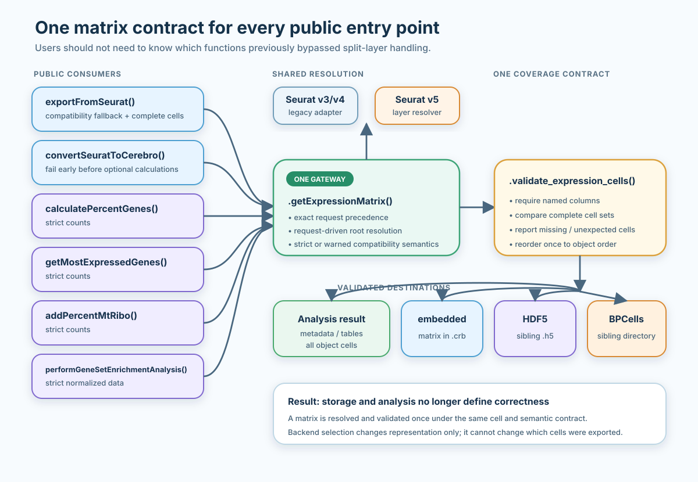

# Seurat v5 layered assays: complete and safe expression matrices

## What this guide solves

Seurat v5 introduced **layers**: one assay can hold several matrices
instead of one fixed `counts`, `data`, and `scale.data` slot. This is
useful for multi-sample workflows because
[`split()`](https://rdrr.io/r/base/split.html) can keep each sample in
its own layer until an integration or join step.

It also changes a basic assumption made by many downstream tools. Asking
an Assay5 for `data` may no longer mean “return one matrix containing
every cell”. The normalized values may instead live in `data.sample_a`,
`data.sample_b`, and more sample-specific layers.

CerebroNexus needs one coherent expression matrix for:

- `.crb` export;
- metadata calculations;
- most-expressed-gene tables;
- mitochondrial and ribosomal percentages;
- gene-set enrichment.

This guide explains:

1.  how split layers differ from custom layers;
2.  how CerebroNexus resolves a complete matrix safely;
3.  which behaviour is automatic;
4.  when CerebroNexus stops and asks you to disambiguate;
5.  how source storage differs from `.crb` output storage;
6.  how to diagnose difficult objects.

## The short version

For an ordinary in-memory Seurat v5 object split by sample, use the same
export call as for an unsplit object:

``` r
library(CerebroNexus)

exportFromSeurat(
  object,
  assay = "RNA",
  slot = "data",
  file = "experiment.crb",
  experiment_name = "experiment",
  organism = "hg",
  groups = c("sample", "seurat_clusters"),
  nUMI = "nCount_RNA",
  nGene = "nFeature_RNA"
)
```

CerebroNexus resolves a unique sample partition, joins only the
requested logical layer, checks that the result contains every object
cell, and then chooses the requested output storage mode.

You normally do **not** need to call
[`JoinLayers()`](https://satijalab.github.io/seurat-object/reference/SplitLayers.html)
yourself.

You do need to intervene when:

- more than one valid partition exists under the requested prefix;
- no partition covers every assay cell;
- the source layers live on disk as BPCells or DelayedArray matrices;
- you deliberately request one partial physical layer for an operation
  that requires the complete object.

## What a layered assay looks like

### Unsplit

An ordinary normalized assay may contain:

``` text
RNA
├── counts
└── data
```

Both layers usually cover the complete object.

Inspect them with:

``` r
SeuratObject::Layers(object[["RNA"]])
SeuratObject::Cells(object[["RNA"]], layer = "data")
```

### Split by sample

After:

``` r
object[["RNA"]] <- split(
  object[["RNA"]],
  f = object$sample
)
```

the assay may contain:

``` text
RNA
├── counts.sample_a
├── counts.sample_b
├── data.sample_a
└── data.sample_b
```

Each physical layer contains only one sample. Together, `data.sample_a`
and `data.sample_b` represent the logical `data` layer.

The suffix does not need to be numeric. It is whatever value was present
in the splitting factor.

## The failure that must be prevented

The unsafe behaviour is not merely “the wrong layer name was selected”.
It is that one part of the exported object describes fewer cells than
the rest.



If a fallback accepts `data.sample_a` alone:

- expression contains sample A;
- metadata contains samples A and B;
- projections contain samples A and B;
- grouping tables contain samples A and B.

The `.crb` is internally contradictory.

This check must happen before output storage modes diverge. An embedded
matrix, an HDF5 sibling, and a BPCells sibling are different
representations of the same data contract; they must not differ in which
errors they catch.

## Why names are not enough

Names that begin with `data` can mean very different things:

``` text
data.sample_a       a real sample split
data.sample_b       a real sample split
data.imputed        a custom full-cell matrix
data_corrected      a custom matrix
dataBackup          a custom matrix
```

Seurat’s `JoinLayers(layers = "data")` uses broad prefix lookup. It may
therefore see all of these as things it could consume.

CerebroNexus uses that same broad set for **join protection**, but only
dotted `data.*` children may prove a `data` partition. It then uses
**cell membership** to decide which eligible children form the real
partition.



A real sample partition has three properties:

1.  it contains at least two non-empty layers;
2.  selected layer memberships are pairwise disjoint;
3.  their union is the complete assay cell set.

A full-cell custom layer is not a split partition. A partial custom
layer that overlaps both samples is not a member of the disjoint
partition.

## How CerebroNexus resolves a request

The request drives resolution. CerebroNexus does not maintain a global
list of every possible custom layer root.

For `slot = "data"`:

1.  if exact `data` exists, read it;
2.  otherwise ask Seurat for the broad set that
    [`JoinLayers()`](https://satijalab.github.io/seurat-object/reference/SplitLayers.html)
    could consume;
3.  restrict partition proof to `data.*` children and identify a unique
    cell partition;
4.  isolate every prefix candidate outside that partition on a local
    object;
5.  join the selected `data` partition;
6.  extract the matrix;
7.  validate complete cell coverage when the consumer requires it.

For `slot = "ambient"`, the same procedure starts from `ambient`. This
supports custom split roots without teaching CerebroNexus the word
`ambient`.



### Exact layer requests

An exact physical layer request is authoritative. For example, this
export request deliberately names one sample layer:

``` r
exportFromSeurat(
  object,
  assay = "RNA",
  slot = "data.sample_b",
  file = "sample_b.crb",
  experiment_name = "sample B",
  organism = "hg",
  groups = "sample",
  nUMI = "nCount_RNA",
  nGene = "nFeature_RNA"
)
```

The resolver honours `data.sample_b`. It does not join the layer away
and return all samples while resolving the request.

This matrix is intentionally partial.
[`exportFromSeurat()`](https://mihem.github.io/CerebroNexus/reference/exportFromSeurat.md)
requires the complete object and therefore rejects the example unless
`object` itself has first been subset to those same sample B cells.

### Exact logical root

If exact `data` already exists, it takes precedence. Siblings beginning
with `data` are not joined into it.

This prevents a custom layer such as `data.imputed` from modifying a
valid standard `data` layer.

### Unique split partition

If exact `data` is absent and `data.sample_a` plus `data.sample_b` form
the only complete disjoint partition, CerebroNexus joins those layers
automatically.

The caller’s object is not persistently changed. Joining happens on the
resolver’s local object value, and the function returns only the
resulting matrix.

### Custom split roots

Custom logical layers can be resolved by request:

``` r
exportFromSeurat(
  object,
  assay = "RNA",
  slot = "ambient",
  file = "ambient.crb",
  experiment_name = "ambient example",
  organism = "hg",
  groups = "sample",
  nUMI = "nCount_RNA",
  nGene = "nFeature_RNA"
)
```

If `ambient.sample_a` and `ambient.sample_b` uniquely partition all
assay cells, the result is complete.

Roots may themselves contain dots. Request `ambient.corrected` to
resolve `ambient.corrected.sample_a` plus `ambient.corrected.sample_b`.

The explicit request matters. If `data` is absent and the only complete
cover is `data.imputed.sample_a` plus `data.imputed.sample_b`, the same
layers are also a complete split of the deeper custom root
`data.imputed`. Names contain no provenance that can prove which meaning
is intended, so CerebroNexus stops and asks you to request
`data.imputed` or join `data` explicitly.

### Ambiguous partitions

Suppose one assay contains both:

``` text
data.sample_a + data.sample_b
data.batch_1  + data.batch_2
```

and each pair independently covers every cell.

Both are structurally valid. CerebroNexus cannot infer which one has the
biological meaning you intended, so it reports both partitions and
stops.

Resolve the ambiguity by:

- requesting an exact physical layer if a partial matrix is intended;
- renaming unrelated layers so they do not share the requested prefix;
- joining the intended layers in Seurat before calling CerebroNexus.

Silently taking the first valid partition would make results depend on
layer order and is not supported.

### No complete partition

If candidates leave cells uncovered or every possible combination
overlaps, CerebroNexus reports:

- the requested assay and layer;
- candidate layer names;
- cell counts per candidate;
- missing cell examples;
- inspection commands.

A partial matrix is never accepted for a full-object operation.

## One resolver for all expression consumers

Layer support is not limited to export. All CerebroNexus functions that
directly need a complete expression matrix use the same resolver and
cell validator.



| Function | Required semantic data | Fallback policy |
|----|----|----|
| [`exportFromSeurat()`](https://mihem.github.io/CerebroNexus/reference/exportFromSeurat.md) | requested `slot` | warned compatibility fallback |
| [`convertSeuratToCerebro()`](https://mihem.github.io/CerebroNexus/reference/convertSeuratToCerebro.md) | requested `slot` | warned compatibility fallback |
| [`calculatePercentGenes()`](https://mihem.github.io/CerebroNexus/reference/calculatePercentGenes.md) | `counts` | strict |
| [`getMostExpressedGenes()`](https://mihem.github.io/CerebroNexus/reference/getMostExpressedGenes.md) | `counts` | strict |
| [`addPercentMtRibo()`](https://mihem.github.io/CerebroNexus/reference/addPercentMtRibo.md) | `counts` | strict |
| [`performGeneSetEnrichmentAnalysis()`](https://mihem.github.io/CerebroNexus/reference/performGeneSetEnrichmentAnalysis.md) | normalized `data` | strict |

The preprocessing functions are strict because raw counts and normalized
values are not interchangeable analysis inputs.

During export, the validated expression matrix is reused by spatial
extraction. This matters for layered assays: the package resolves and
joins the requested root once, then intersects the same matrix with each
image’s coordinates. It does not independently resolve the assay again
for every spatial image. Spatial payloads retain both the requested
layer and the physical layer. For example, a warned `data -> counts`
compatibility fallback is stored as `requested_layer = "data"` and
`layer = "counts"` rather than mislabelling raw counts as normalized
data.

[`getMarkerGenes()`](https://mihem.github.io/CerebroNexus/reference/getMarkerGenes.md)
delegates to Seurat’s marker machinery and does not use this direct
matrix path.

## Behaviour by scenario

| Assay state | Request | Behaviour |
|----|----|----|
| exact full `data` | `data` | read exact layer |
| exact partial `data.sample_b` | exact name | honour exact layer |
| unique `data.*` sample partition | `data` | isolate custom prefixes and join |
| unique `ambient.*` partition | `ambient` | resolve without a whitelist |
| full `data.imputed`, no exact `data` | strict `data` | error; do not reinterpret it |
| overlapping partial custom layer plus true partition | `data` | select independent true partition |
| two valid partitions | root | ambiguity error |
| partition misses cells | root | coverage error |
| no normalized data, complete counts | export requests `data` | warn before compatibility fallback |
| partial `data.imputed`, complete counts | export requests `data` | ignore incomplete noise, warn, use complete counts |
| no normalized data, complete counts | enrichment requests `data` | strict error |
| BPCells-backed source | any | materialisation error |

## Source storage and output storage are different

Two independent choices are easy to confuse.

### Source assay storage

This describes how the input Seurat object stores its layers:

- in-memory `matrix`;
- sparse `dgCMatrix`;
- BPCells `IterableMatrix`;
- DelayedArray-backed matrix.

CerebroNexus automatically joins in-memory Seurat v5 partitions.
Disk-backed source layers must currently be materialised first. Every
member of the chosen partition is checked, so a mixed in-memory/BPCells
partition is rejected regardless of layer order.

### Output expression storage

`expression_matrix_mode` describes how CerebroNexus writes the resolved
matrix:

- `"embedded"`: inside the `.crb`;
- `"h5"`: a sibling HDF5 file;
- `"bpcells"`: a sibling BPCells directory.

Choosing `expression_matrix_mode = "bpcells"` does not make a
BPCells-backed source assay readable. Source resolution happens first;
output storage happens after the complete matrix has been validated.

## Disk-backed source layers

When a source layer lives on disk, CerebroNexus stops with a
materialisation recipe. Materialise **every layer**, not only the first
layer matching the request:

``` r
assay <- "RNA"

for (layer in SeuratObject::Layers(object[[assay]])) {
  SeuratObject::LayerData(
    object[[assay]],
    layer = layer
  ) <- methods::as(
    SeuratObject::LayerData(
      object[[assay]],
      layer = layer
    ),
    "dgCMatrix"
  )
}
```

Then rerun the CerebroNexus operation.

Materialising one `counts.*` layer alone recreates the partial-sample
problem. The loop is intentionally all-layer.

## Memory and performance

### What is linear

For a normal split assay, partition detection:

1.  maps cell names to integer IDs once;
2.  counts layer ownership once;
3.  confirms that every cell belongs to exactly one candidate.

Work is approximately linear in total membership size.

### What happens with custom overlaps

If unrelated custom layers overlap the true sample partition,
CerebroNexus uses an indexed exact-cover search. Cell-to-layer adjacency
and conflicts are precomputed, so recursive decisions do not repeatedly
scan every cell against every layer.

If two solutions are found, search stops and reports ambiguity.

Conflict indexing, visited search nodes, and recursion depth have
independent deterministic budgets. The depth budget is checked before
the next recursive call. Pathological sets of highly overlapping prefix
layers therefore stop with an actionable request to rename unrelated
layers or join explicitly instead of exhausting memory or R’s call
stack.

### What still materialises

[`JoinLayers()`](https://satijalab.github.io/seurat-object/reference/SplitLayers.html)
materialises the requested logical root. A large split assay therefore
has a temporary memory peak.

CerebroNexus reduces avoidable cost by:

- joining only the requested root, not every split root;
- not backing up full custom matrices;
- resolving layer membership before matrix joining;
- handing the validated matrix from
  [`convertSeuratToCerebro()`](https://mihem.github.io/CerebroNexus/reference/convertSeuratToCerebro.md)
  to
  [`exportFromSeurat()`](https://mihem.github.io/CerebroNexus/reference/exportFromSeurat.md)
  instead of joining the same split root twice.

If the object is too large to materialise safely, join or convert it in
a memory-appropriate preprocessing environment before exporting.

## Troubleshooting

### 1. List physical layers

``` r
SeuratObject::Layers(object[["RNA"]])
```

### 2. Count cells in each layer

``` r
vapply(
  SeuratObject::Layers(object[["RNA"]]),
  function(layer) {
    length(SeuratObject::Cells(object[["RNA"]], layer = layer))
  },
  integer(1)
)
```

### 3. Inspect memberships

``` r
SeuratObject::Cells(
  object[["RNA"]],
  layer = "data.sample_a"
)
```

Compare them with:

``` r
SeuratObject::Cells(object)
```

### 4. Check whether an exact root already exists

``` r
"data" %in% SeuratObject::Layers(object[["RNA"]])
```

If true, CerebroNexus reads exact `data` and does not join prefix
siblings.

### 5. Inspect Seurat’s prefix candidates

``` r
SeuratObject::Layers(
  object[["RNA"]],
  search = "data"
)
```

These are the layers Seurat may consider when joining the `data` root.

### 6. Join manually when you know the intended semantics

``` r
object[["RNA"]] <- SeuratObject::JoinLayers(
  object[["RNA"]],
  layers = "data",
  new = "data"
)
```

Before doing this, rename or remove unrelated prefix layers. Seurat’s
prefix lookup may otherwise include custom names such as `dataBackup`.

Always verify:

``` r
stopifnot(
  setequal(
    SeuratObject::Cells(object),
    SeuratObject::Cells(object[["RNA"]], layer = "data")
  )
)
```

## Reading common errors

### “Resolved layer covers X of Y object cells”

The request was resolved exactly, but the consumer requires the complete
object. This commonly follows an exact request such as
`slot = "data.sample_b"`.

Use the logical root (`slot = "data"`) to request a join, or subset the
Seurat object itself to the same cells before exporting.

### “More than one valid cell partition”

Two layer combinations both cover the assay. Rename unrelated layers or
join the intended representation explicitly.

### “No unique disjoint partition covers the assay”

The prefix candidates are incomplete, overlapping, or both. Inspect
membership counts and check whether a sample layer was removed during
preprocessing.

### “Layer lives on disk”

The source layer is BPCells- or DelayedArray-backed. Follow the
all-layer materialisation loop in the message. Changing
`expression_matrix_mode` does not solve source storage.

### Cross-semantic fallback warning

Export compatibility used a complete matrix from another semantic class.
Read the warning carefully: using `counts` instead of normalized `data`
changes the meaning of expression values.

For analysis functions, supply the required semantic layer instead; they
do not perform this substitution.

### “Error processing …”

[`convertSeuratToCerebro()`](https://mihem.github.io/CerebroNexus/reference/convertSeuratToCerebro.md)
adds the input source to an export error and then rethrows it. Treat
this as a failed conversion: no new `.crb` was produced. Remove or
archive any older output with the same name before retrying if your
workflow discovers files by name alone.

## Recommended workflow

1.  Preserve sample-split layers while you need them for Seurat
    integration.
2.  Run CerebroNexus preprocessing functions directly; they resolve
    complete partitions without changing the caller’s assay.
3.  Export with the logical layer name, usually `slot = "data"`.
4.  Treat ambiguity and incomplete coverage as data-contract errors, not
    warnings to suppress.
5.  Choose embedded, HDF5, or BPCells output based on deployment needs
    only after source resolution is understood.

## See also

- [Introduction to the CerebroNexus workflow with
  Seurat](https://mihem.github.io/CerebroNexus/articles/cerebronexus_workflow_seurat.md)
- [Create an expression matrix in HDF5
  format](https://mihem.github.io/CerebroNexus/articles/create_expression_matrix_in_h5_format.md)
- [Create a self-contained Shiny
  application](https://mihem.github.io/CerebroNexus/articles/create_a_self_contained_shiny_app.md)

## Session information

``` r
sessionInfo()
```
