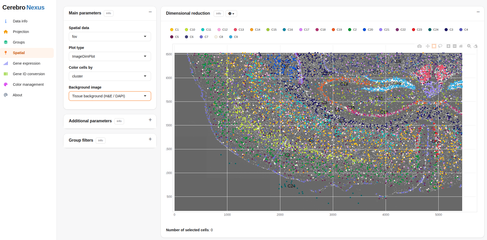

[](https://github.com/mihem/CerebroNexus/actions/workflows/R-cmd-check.yaml)
[](https://opensource.org/licenses/MIT)


**CerebroNexus** (**Ce**ll**Re**port**Bro**wser **Nexus**) is a
[Shiny](https://shiny.posit.co/) platform for exploring and sharing
single-cell and spatial transcriptomics data, with gene-expression,
immune-repertoire, trajectory, and HLA-TCR analyses. See the [full
documentation](https://mihem.github.io/CerebroNexus/).

[Try the live demo](https://osmzhlab.uni-muenster.de/shiny/demo/).

*CerebroNexus began as a fork of
[cerebroApp](https://github.com/romanhaa/cerebroApp) by Roman Hillje and
has since evolved with substantial new features and active development
by [mihem](https://github.com/mihem) and [Xuesong
Wang](https://github.com/duocang).*

Automated tests run in a reproducible Nix environment.



CerebroNexus spatial data view

## 1. Installation

``` r
remotes::install_github('mihem/CerebroNexus')
```

## 2. Quick Start

``` r
library(CerebroNexus)

convertSeuratToCerebro(
  seurat_file = "my_seurat.rds",
  result_dir = "output",
  groups = c("sample", "cluster")
)

createShinyApp(
  cerebro_data = c("My dataset" = "output/cerebro_my_seurat.crb"),
  result_dir = "my_app"
)
```

## License

MIT, see [LICENSE.md](https://mihem.github.io/CerebroNexus/LICENSE.md).
